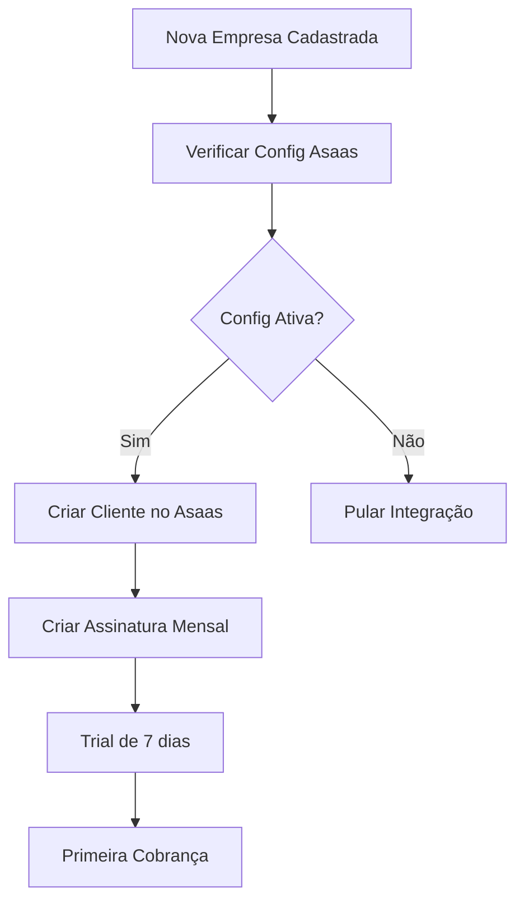
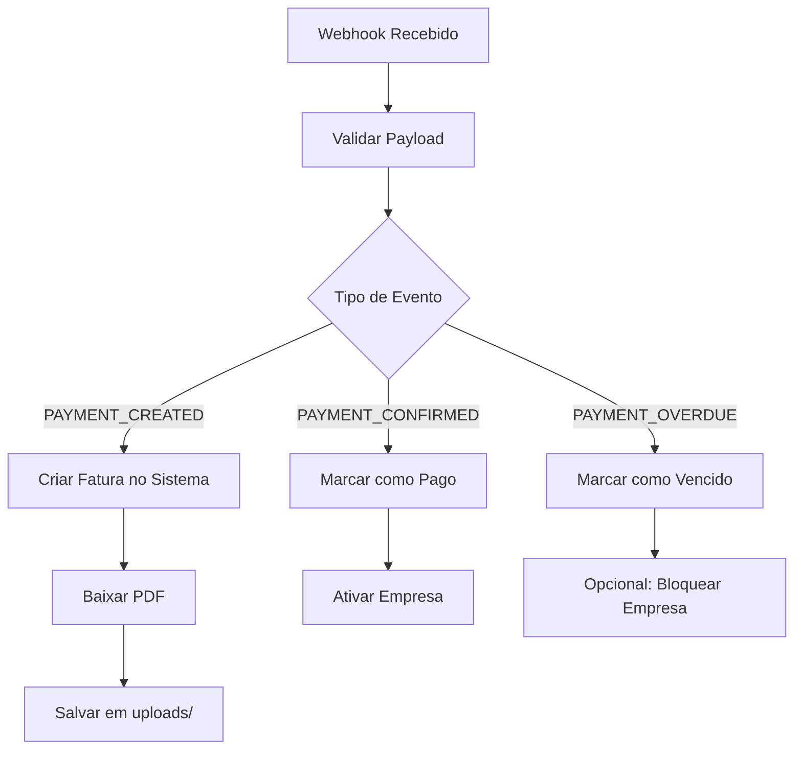

# Integração com Asaas - Smart Atendimento

## 📋 Visão Geral

Esta integração permite que o sistema Smart Atendimento se conecte automaticamente com o Asaas para:

- ✅ Criar clientes automaticamente quando uma empresa se cadastra
- ✅ Gerar assinaturas mensais com 7 dias de trial gratuito
- ✅ Sincronizar faturas automaticamente via webhook
- ✅ Armazenar PDFs das faturas organizados por empresa e mês
- ✅ Manter empresas ativas quando pagamentos são confirmados

## 🚀 Instalação

### 1. Executar Migrations

```bash
cd backend
node run-asaas-migrations.js
```

### 2. Reiniciar o Servidor

```bash
# Backend
npm run dev:server

# Frontend  
npm start
```

## ⚙️ Configuração

### 1. Configurar no Frontend

1. Acesse **Integrações > ASAAS**
2. Insira sua **Chave de API** do Asaas
3. Selecione o **Ambiente** (Sandbox ou Produção)
4. Configure a **URL do Webhook** (opcional)
5. Clique em **Salvar Configurações**

### 2. Testar Integração

1. Clique em **Testar Conexão**
2. Clique em **Criar Cliente** (se necessário)
3. Clique em **Criar Assinatura** (se necessário)
4. Clique em **Sincronizar Faturas** para importar faturas existentes

### 3. Configurar Webhook no Asaas

1. Acesse seu painel do Asaas
2. Vá em **Integrações > Webhooks**
3. Adicione a URL: `https://seu-dominio.com/asaas/webhook`
4. Selecione os eventos:
   - `PAYMENT_CREATED`
   - `PAYMENT_CONFIRMED`
   - `PAYMENT_RECEIVED`
   - `PAYMENT_OVERDUE`
   - `PAYMENT_DELETED`

## 📁 Estrutura de Arquivos

### Backend

```
backend/src/
├── models/
│   ├── AsaasConfig.ts          # Configurações do Asaas por empresa
│   └── Invoices.ts             # Faturas (atualizado com campos Asaas)
├── services/AsaasService/
│   ├── AsaasService.ts         # Cliente da API do Asaas
│   ├── CreateAsaasCustomerService.ts
│   ├── CreateAsaasSubscriptionService.ts
│   ├── ProcessAsaasWebhookService.ts
│   ├── SyncAsaasInvoicesService.ts
│   └── AutoCreateAsaasService.ts
├── controllers/
│   └── AsaasController.ts      # Endpoints da API
└── routes/
    └── asaasRoutes.ts          # Rotas da integração
```

### Frontend

```
frontend/src/
├── components/
│   └── AsaasManager/
│       └── index.js            # Interface de configuração
└── pages/Integrations/
    └── AsaasTab.js             # Aba do Asaas nas integrações
```

### Uploads

```
uploads/
└── {company_id}/
    └── invoices/
        └── {YYYY-MM}/
            └── invoice_{id}_{asaas_id}.pdf
```

## 🔄 Fluxo de Funcionamento

### 1. Cadastro de Nova Empresa



### 2. Processamento de Webhook



## 📊 Banco de Dados

### Nova Tabela: AsaasConfigs

```sql
CREATE TABLE AsaasConfigs (
  id SERIAL PRIMARY KEY,
  companyId INTEGER UNIQUE REFERENCES Companies(id),
  apiKey VARCHAR NOT NULL,
  webhookUrl VARCHAR,
  environment VARCHAR DEFAULT 'sandbox',
  asaasCustomerId VARCHAR,
  asaasSubscriptionId VARCHAR,
  enabled BOOLEAN DEFAULT true,
  createdAt TIMESTAMP,
  updatedAt TIMESTAMP
);
```

### Tabela Atualizada: Invoices

```sql
ALTER TABLE Invoices ADD COLUMN asaasInvoiceId VARCHAR;
ALTER TABLE Invoices ADD COLUMN asaasSubscriptionId VARCHAR;
ALTER TABLE Invoices ADD COLUMN paymentMethod VARCHAR;
ALTER TABLE Invoices ADD COLUMN paymentDate TIMESTAMP;
ALTER TABLE Invoices ADD COLUMN billingType VARCHAR;
ALTER TABLE Invoices ADD COLUMN invoiceUrl VARCHAR;
```

## 🔗 Endpoints da API

### Configuração

- `GET /asaas` - Listar configuração
- `POST /asaas` - Criar configuração
- `PUT /asaas` - Atualizar configuração

### Operações

- `POST /asaas/test` - Testar conexão
- `POST /asaas/customer` - Criar cliente
- `POST /asaas/subscription` - Criar assinatura
- `POST /asaas/sync-invoices` - Sincronizar faturas

### Webhook

- `POST /asaas/webhook` - Receber notificações (público)

## 🔒 Segurança

### Variáveis de Ambiente

```env
# Não é necessário adicionar nada ao .env
# As chaves são armazenadas no banco por empresa
```

### Validações

- ✅ Chave de API obrigatória
- ✅ Validação de empresa por token JWT
- ✅ Isolamento de dados por companyId
- ✅ Logs detalhados de todas as operações

## 🐛 Troubleshooting

### Erro: "Configuração do Asaas não encontrada"

1. Verifique se a configuração foi salva corretamente
2. Confirme se a chave de API está preenchida
3. Verifique se a integração está habilitada

### Erro: "Cliente não criado no Asaas"

1. Teste a conexão com a API
2. Verifique se os dados da empresa estão completos
3. Confirme se a chave de API tem permissões adequadas

### Webhook não está funcionando

1. Verifique se a URL está acessível publicamente
2. Confirme se os eventos estão configurados no Asaas
3. Verifique os logs do servidor para erros

### Faturas não estão sendo sincronizadas

1. Execute a sincronização manual primeiro
2. Verifique se a assinatura foi criada corretamente
3. Confirme se há pagamentos na assinatura do Asaas

## 📞 Suporte

Para dúvidas ou problemas:

1. Verifique os logs do servidor backend
2. Teste cada etapa individualmente
3. Confirme as configurações no painel do Asaas
4. Verifique se as migrations foram executadas corretamente

## 🎯 Próximas Melhorias

- [ ] Dashboard com métricas de pagamento
- [ ] Notificações por email para pagamentos
- [ ] Relatórios financeiros integrados
- [ ] Suporte a múltiplos métodos de pagamento
- [ ] Integração com outros gateways de pagamento