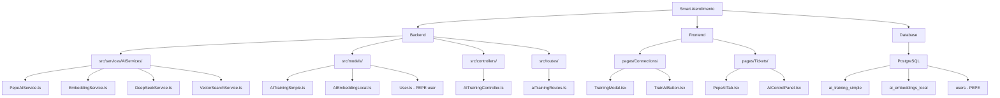
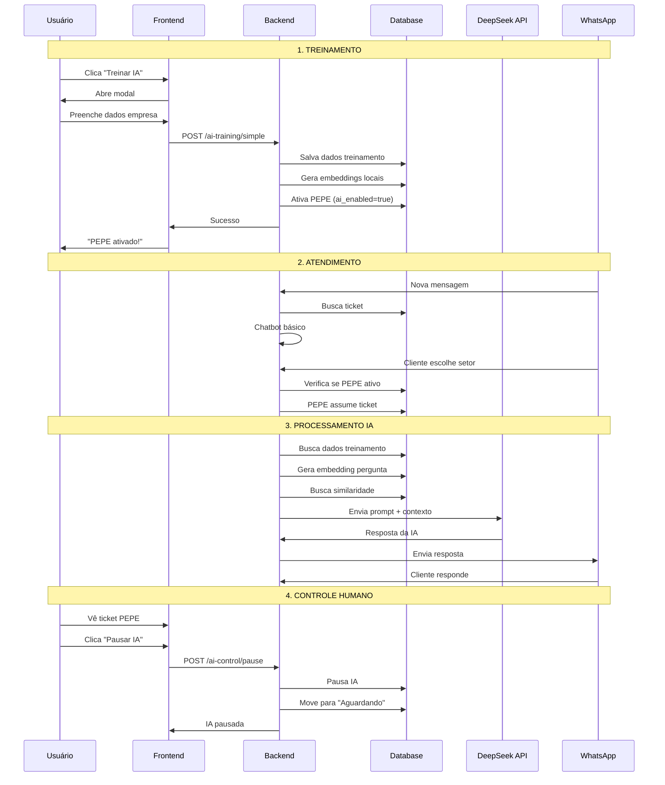
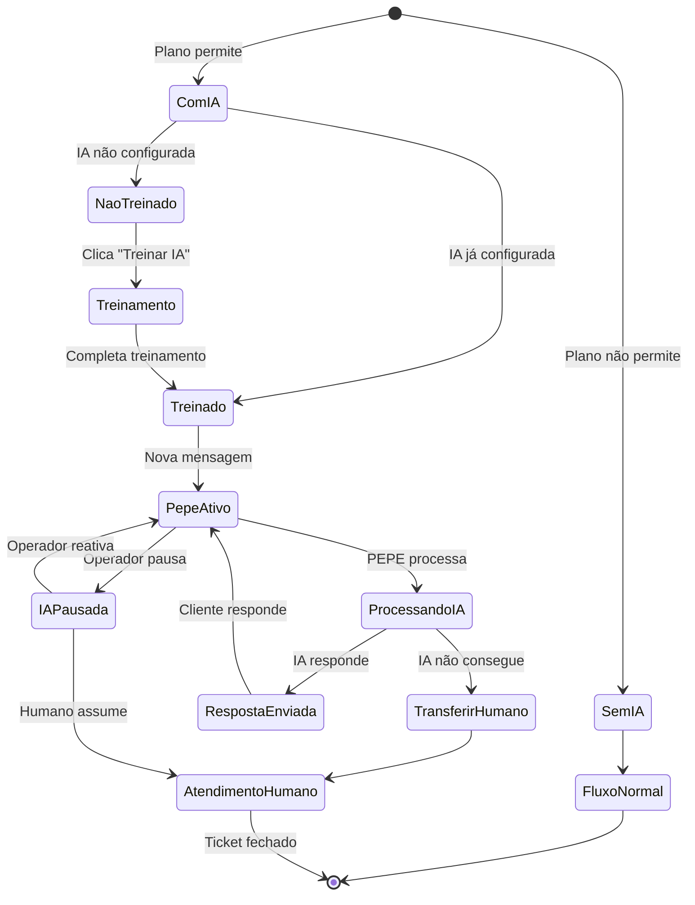

# Fluxograma Completo - Integração Agente PEPE

## 🔄 FLUXOGRAMA PRINCIPAL

```mermaid
graph TD
    A[Sistema Smart Atendimento] --> B{Plano tem IA?}
    
    B -->|Não| C[Fluxo Normal sem IA]
    B -->|Sim| D[Minhas Conexões]
    
    D --> E[Botão "Treinar IA" visível]
    E --> F{IA já treinada?}
    
    F -->|Não| G[Modal de Treinamento]
    F -->|Sim| H[Botão "IA Ativa ✅"]
    
    G --> I[Formulário Empresa]
    I --> J[Preenche Dados]
    J --> K[Clica "Treinar/Concluir"]
    K --> L[Salva no Banco]
    L --> M[Gera Embeddings]
    M --> N[Ativa PEPE]
    N --> O[PEPE Pronto]
    
    O --> P[Nova Mensagem WhatsApp]
    P --> Q[Chatbot Básico]
    Q --> R[Cliente Escolhe Setor]
    R --> S{PEPE Ativo?}
    
    S -->|Não| T[Vai para "Aguardando"]
    S -->|Sim| U[PEPE Assume Ticket]
    
    U --> V[Busca Similaridade]
    V --> W[Gera Resposta]
    W --> X{Conseguiu Responder?}
    
    X -->|Sim| Y[Envia Resposta]
    X -->|Não| Z[Transfere para Humano]
    
    Y --> AA[Cliente Responde]
    AA --> V
    
    Z --> T
    
    H --> AB[Pode Editar Treinamento]
    AB --> G
```

## 📋 FLUXO DETALHADO POR ETAPAS

### 1️⃣ CONFIGURAÇÃO INICIAL

```mermaid
graph TD
    A[Admin do Sistema] --> B[Configurações > Planos]
    B --> C[Edita Plano]
    C --> D{Habilitar IA?}
    
    D -->|Sim| E[ai_agent_enabled = true]
    D -->|Não| F[ai_agent_enabled = false]
    
    E --> G[Empresa pode usar PEPE]
    F --> H[Empresa sem acesso IA]
    
    G --> I[Usuário vê botão "Treinar IA"]
    H --> J[Usuário não vê botão]
```

### 2️⃣ TREINAMENTO DO PEPE

```mermaid
graph TD
    A[Usuário em "Minhas Conexões"] --> B{Plano permite IA?}
    
    B -->|Não| C[Botão desabilitado]
    B -->|Sim| D{IA já treinada?}
    
    D -->|Não| E[Botão "Treinar IA"]
    D -->|Sim| F[Botão "IA Ativa ✅"]
    
    E --> G[Clica no botão]
    G --> H[Abre Modal]
    
    H --> I[Preenche Nome da Empresa]
    I --> J[Seleciona Tipo de Negócio]
    J --> K[Descreve Produtos/Serviços]
    K --> L[Adiciona Horário]
    L --> M[Adiciona Contato]
    M --> N[Adiciona Endereço]
    N --> O[Adiciona Site opcional]
    
    O --> P[Clica "Treinar/Concluir"]
    
    P --> Q[Valida Campos Obrigatórios]
    Q --> R{Dados válidos?}
    
    R -->|Não| S[Mostra erro]
    R -->|Sim| T[Salva no Banco]
    
    S --> I
    
    T --> U[Gera Embeddings Locais]
    U --> V[Ativa PEPE para Conexão]
    V --> W[Fecha Modal]
    W --> X[Notificação: "PEPE ativado!"]
    X --> Y[Botão vira "IA Ativa ✅"]
    
    F --> Z[Pode editar treinamento]
    Z --> H
```

### 3️⃣ PROCESSAMENTO DE MENSAGENS

```mermaid
graph TD
    A[Nova Mensagem WhatsApp] --> B[wbotMessageListener.ts]
    B --> C{É mensagem válida?}
    
    C -->|Não| D[Ignora mensagem]
    C -->|Sim| E[Cria/Busca Ticket]
    
    E --> F{Tem setor selecionado?}
    
    F -->|Não| G[Chatbot Básico]
    F -->|Sim| H{PEPE ativo?}
    
    G --> I[Mostra opções de setores]
    I --> J[Cliente escolhe setor]
    J --> K[Atualiza ticket.queueId]
    K --> H
    
    H -->|Não| L[Fluxo normal]
    H -->|Sim| M[Verifica se IA pausada]
    
    L --> N[Ticket vai para "Aguardando"]
    
    M --> O{IA pausada?}
    O -->|Sim| N
    O -->|Não| P[PEPE assume ticket]
    
    P --> Q[ticket.userId = pepe@ai.system]
    Q --> R[ticket.aiAssisted = true]
    R --> S[ticket.status = "open"]
    S --> T[Move para aba "Pepe AI"]
```

### 4️⃣ PROCESSAMENTO COM IA

```mermaid
graph TD
    A[PEPE recebe mensagem] --> B[Busca dados de treinamento]
    B --> C[Gera embedding da pergunta]
    C --> D[Busca similaridade no banco]
    
    D --> E{Encontrou contexto?}
    
    E -->|Não| F[Score < 0.7]
    E -->|Sim| G[Score >= 0.7]
    
    F --> H[Não consegue responder]
    G --> I[Monta prompt com contexto]
    
    I --> J[Envia para DeepSeek API]
    J --> K[Recebe resposta da IA]
    K --> L{Resposta válida?}
    
    L -->|Não| H
    L -->|Sim| M[Envia resposta para cliente]
    
    H --> N[Gera alerta]
    N --> O[Transfere para "Aguardando"]
    O --> P[ticket.userId = null]
    P --> Q[ticket.aiAssisted = false]
    Q --> R[Notifica atendentes]
    
    M --> S[Cliente pode responder]
    S --> T[Nova mensagem]
    T --> A
```

### 5️⃣ CONTROLES OPERACIONAIS

```mermaid
graph TD
    A[Atendente vê ticket PEPE] --> B[Opções disponíveis]
    
    B --> C[Pausar IA]
    B --> D[Assumir Controle]
    B --> E[Reativar IA]
    
    C --> F[IA pausada]
    F --> G[Ticket fica em "Aguardando"]
    
    D --> H[Atendente assume]
    H --> I[ticket.userId = atendente.id]
    I --> J[ticket.aiAssisted = false]
    
    E --> K{IA estava pausada?}
    K -->|Sim| L[Reativa PEPE]
    K -->|Não| M[IA já ativa]
    
    L --> N[ticket.userId = pepe@ai.system]
    N --> O[ticket.aiAssisted = true]
    O --> P[Volta para "Pepe AI"]
```

## 🗂️ ESTRUTURA DE ARQUIVOS



## 🔄 FLUXO DE DADOS



## 📊 ESTADOS DO SISTEMA



## 🎯 PONTOS DE DECISÃO CRÍTICOS

### 1. Verificação de Plano
```
if (company.plan.ai_agent_enabled) {
  // Mostra botão "Treinar IA"
} else {
  // Esconde botão ou mostra desabilitado
}
```

### 2. Ativação do PEPE
```
if (ticket.queueId && !ticket.userId && whatsapp.ai_enabled) {
  // PEPE assume o ticket
} else {
  // Fluxo normal para "Aguardando"
}
```

### 3. Busca por Similaridade
```
if (similarityScore >= 0.7) {
  // Usa contexto encontrado
} else {
  // Transfere para humano
}
```

### 4. Controle de IA
```
if (aiSession.isPaused) {
  // Não processa com IA
} else {
  // PEPE pode processar
}
```

---

## 📋 CHECKLIST DE IMPLEMENTAÇÃO

### ✅ Configuração
- [ ] Parâmetro `ai_agent_enabled` nos planos
- [ ] Usuário PEPE no sistema
- [ ] Extensão pgvector no PostgreSQL

### ✅ Treinamento
- [ ] Modal de treinamento na tela Conexões
- [ ] API de salvamento de dados
- [ ] Geração de embeddings locais
- [ ] Ativação automática do PEPE

### ✅ Processamento
- [ ] Integração com DeepSeek API
- [ ] Busca por similaridade vetorial
- [ ] Geração de respostas contextuais
- [ ] Sistema de fallback para humanos

### ✅ Interface
- [ ] Nova aba "Pepe AI" nos atendimentos
- [ ] Controles de pausa/retomada
- [ ] Indicadores visuais de IA ativa
- [ ] Alertas para intervenção humana

### ✅ Monitoramento
- [ ] Logs de atividade do PEPE
- [ ] Métricas de performance
- [ ] Sistema de alertas
- [ ] Controle de custos (mesmo sendo gratuito)

---

**Este fluxograma representa a integração completa do Agente PEPE no Smart Atendimento, desde a configuração inicial até o atendimento automatizado com controles humanos.**